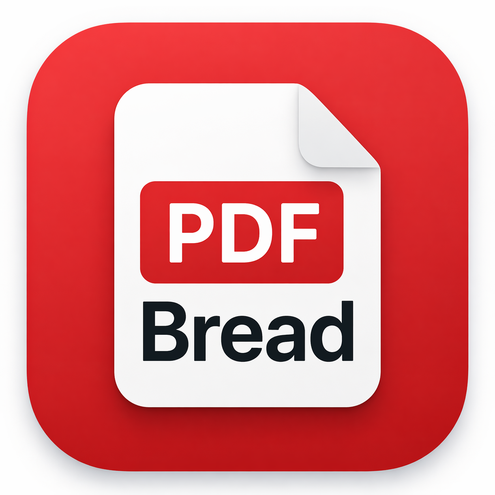
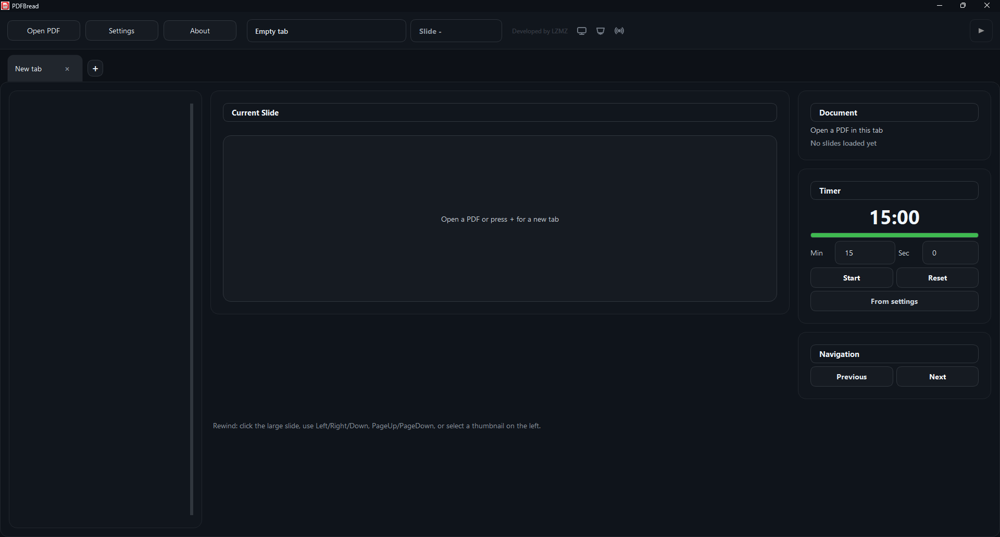

# PDFBread



PDFBread is a desktop PDF presenter for live talks, lectures, streams, and small production setups. It provides a main presentation output, a separate teleprompter output, tabbed PDF decks, timers, and optional NDI output.

Developed by **LZMZ**.

## Features

- Open multiple PDF decks in separate tabs.
- Show the current slide on the main output screen.
- Use a separate teleprompter screen with two modes:
  - **Configuration 1: Teleprompter** - current slide, next slide, slide counter, and timer.
  - **Configuration 2: Mirror main** - duplicate the main output on the teleprompter screen.
- Send the main and teleprompter outputs to NDI when NDI Runtime or NDI Tools are installed.
- Switch the live output to another PDF tab without stopping the show.
- Protect the currently live tab from accidentally loading another PDF.
- Use per-tab timers with start, pause, continue, reset, and a progress bar.
- Navigate slides with keyboard shortcuts, thumbnails, or by clicking the large preview.
- Use RU/EN interface language from the settings window.
- Edit the visual style through `theme.qss`.

## Screenshot



## Requirements

- Windows 10/11 is the primary target.
- Python 3.11 or newer.
- PySide6.
- PyMuPDF.
- Optional: NDI Runtime or NDI Tools for NDI output.

## Quick Start

```powershell
python -m venv .venv
.\.venv\Scripts\activate
pip install -r requirements.txt
pip install -e .
python -m pdfbread
```

If you use the included launcher:

```powershell
run_pdfbread.bat
```

## Usage

- `Open PDF` loads a PDF into the current tab.
- `+` creates a new empty PDF tab.
- `Settings` opens output screen, NDI, language, teleprompter mode, and default timer settings.
- The play button starts the selected outputs.
- The stop button stops fullscreen and NDI output.
- `Take tab live` switches the live output to the currently selected tab.
- `About` shows app version and project information.

## Keyboard Controls

- `Right`, `Down`, `PageDown`, `Space` - next slide.
- `Left`, `Up`, `PageUp`, `Backspace` - previous slide.
- `Esc` in fullscreen output windows - stop output.

## NDI

NDI is optional. Install NDI Runtime or NDI Tools if you want PDFBread to publish NDI sources.

PDFBread can create:

- `PDFBread Main` - main presentation output.
- `PDFBread Teleprompter` - teleprompter output or mirrored main output, depending on the teleprompter mode.

## Project Structure

```text
PDFBread/
  src/pdfbread/          Application source code
  screen/main.png        Main UI screenshot
  theme.qss              Qt stylesheet
  icon.png               App icon
  run_pdfbread.bat       Windows launcher
  requirements.txt       Runtime dependencies
  pyproject.toml         Python package metadata
```

## License

This project is licensed under the MIT License. See [LICENSE](LICENSE).

---

# PDFBread на русском


PDFBread - настольное приложение для показа PDF-презентаций на выступлениях, лекциях, трансляциях и небольших production-сетапах. В приложении есть главный экран презентации, отдельный экран суфлёра, вкладки с PDF, таймеры и опциональный вывод в NDI.

Разработал **LZMZ**.

## Возможности

- Открытие нескольких PDF-презентаций в отдельных вкладках.
- Вывод текущего слайда на главный экран.
- Отдельный экран суфлёра с двумя режимами:
  - **1 конфигурация: суфлёр** - текущий слайд, следующий слайд, номер слайда и таймер.
  - **2 конфигурация: дубль main** - суфлёр показывает тот же кадр, что и главный экран.
- Вывод главного экрана и суфлёра в NDI при установленном NDI Runtime или NDI Tools.
- Переключение эфира на другую вкладку без остановки показа.
- Защита вкладки, которая уже в эфире, от случайной загрузки другого PDF.
- Таймер в каждой вкладке: старт, пауза, продолжить, сброс и progress bar.
- Навигация по слайдам с клавиатуры, миниатюр или кликом по большому preview.
- Переключение языка интерфейса RU/EN в настройках.
- Настройка внешнего вида через `theme.qss`.

## Скриншот


## Требования

- Основная целевая платформа: Windows 10/11.
- Python 3.11 или новее.
- PySide6.
- PyMuPDF.
- Опционально: NDI Runtime или NDI Tools для вывода NDI.

## Быстрый старт

```powershell
python -m venv .venv
.\.venv\Scripts\activate
pip install -r requirements.txt
pip install -e .
python -m pdfbread
```

Или через готовый launcher:

```powershell
run_pdfbread.bat
```

## Использование

- `Открыть PDF` загружает PDF в текущую вкладку.
- `+` создает новую пустую вкладку.
- `Настройки` открывает выбор экранов, NDI, язык, режим суфлёра и таймер по умолчанию.
- Кнопка запуска начинает вывод выбранных экранов.
- Кнопка стоп останавливает fullscreen и NDI.
- `Вывести вкладку` переключает эфир на текущую вкладку.
- `О программе` показывает версию и информацию о проекте.

## Управление

- `Right`, `Down`, `PageDown`, `Space` - следующий слайд.
- `Left`, `Up`, `PageUp`, `Backspace` - предыдущий слайд.
- `Esc` в fullscreen-окнах вывода - остановить показ.

## NDI

NDI не обязателен. Для публикации NDI-источников установите NDI Runtime или NDI Tools.

PDFBread может создавать:

- `PDFBread Main` - основной поток презентации.
- `PDFBread Teleprompter` - поток суфлёра или дубль главного экрана, в зависимости от режима суфлёра.

## Структура проекта

```text
PDFBread/
  src/pdfbread/          Исходный код приложения
  screen/main.png        Скриншот главного интерфейса
  theme.qss              Qt stylesheet
  icon.png               Иконка приложения
  run_pdfbread.bat       Windows launcher
  requirements.txt       Runtime-зависимости
  pyproject.toml         Метаданные Python-пакета
```

## Лицензия

Проект распространяется по лицензии MIT. См. [LICENSE](LICENSE).
